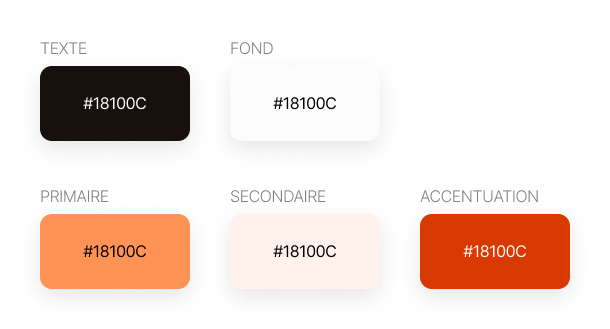
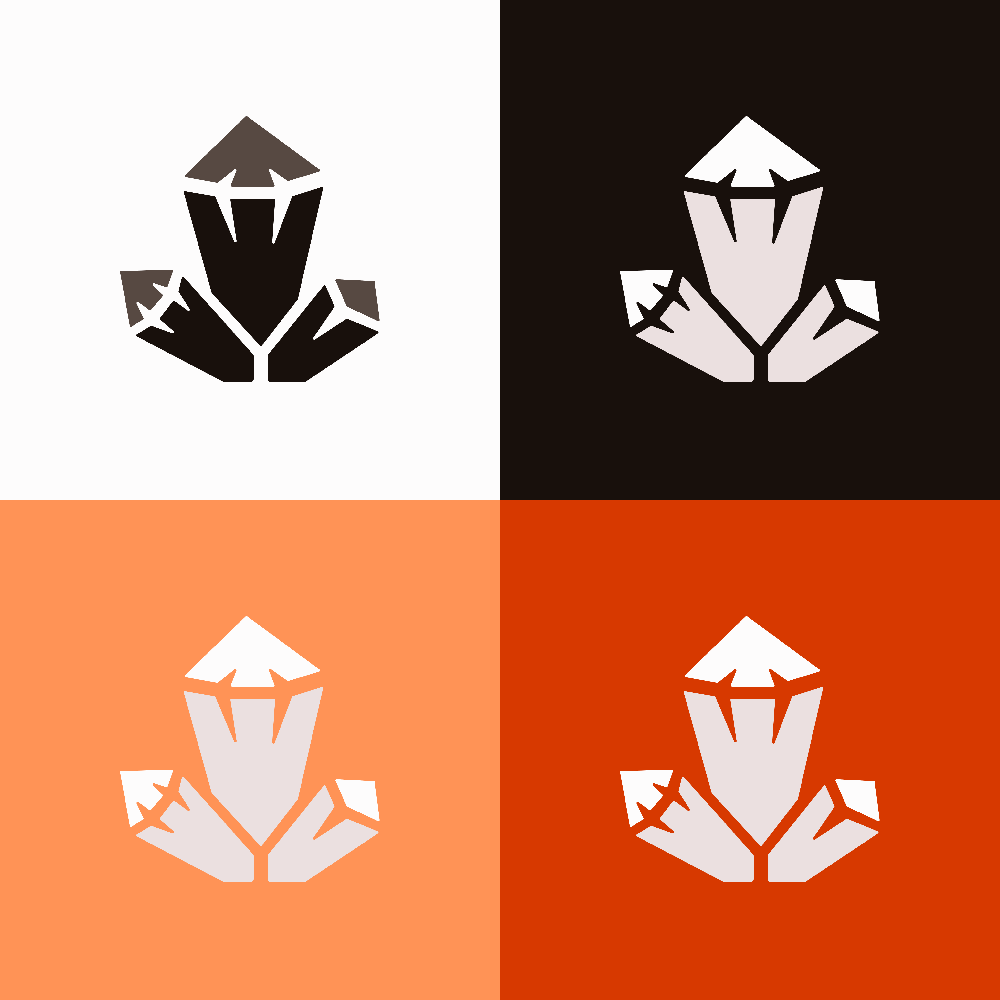

# Identité graphique
Comme toute marque, entreprise, association ou application, nous disposons de guides et de règles graphique ! Une ligne directrice finalement.  
Découvrez notre identité graphique au travers de nos réflexions et comprenez ce qui nous a poussé à faire ces choix.

## Table des matières
- [Palette de couleurs](#palette-de-couleurs)
- [Nom et logos](#nom-et-logos)
- [Composants](#composants)

## Palette de couleurs
D'après la signification des couleurs, nous avons choisit de partir sur une palette plutôt orangée.  
En effet, nous vous parlions de la signification des couleurs, en voici les valeurs :
- Courage
- Enthousiasme
- Confiance en soit
- Vitalité

Rien de plus parlant qu'une image :  

Cela reste très confu, n'est-ce pas ?  
Alors voici un peu plus de précisions 👍  

## Nom et logos
Étant férus de sciences, nous nous sommes basés sur les minéraux que la physique nous propose.  
Vous retrouverez donc la racine "**Quartz**" composant notre nom ! Nous avons ajouté le suffix "**ly**" pour quelque chose de plus familier et distinctif.

En ce qui concerne la conception de notre logo, nous avons opter pour une représentation simplifiée de ce minerai.  
Ce logo est constitué de trois cristaux, un par valeur que nous souhaitions porter avec notre solution :
- Fiable
- Abordable
- Polyvalent

Sans plus attendre, trouvez ci-dessous notre vision du quartz ^^  

## Composants
A venir...
